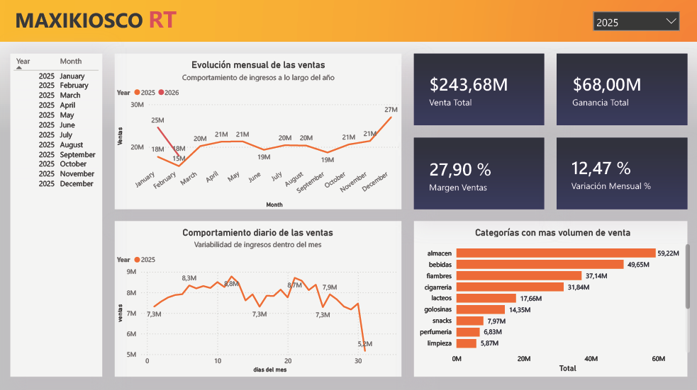
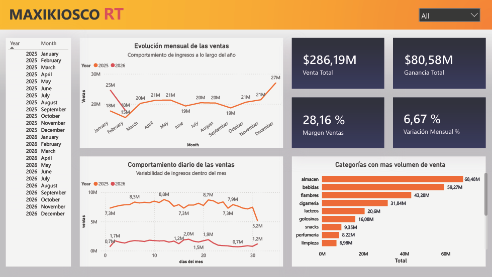
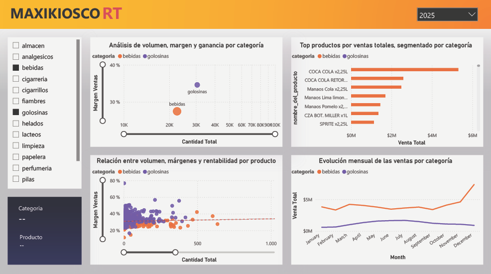
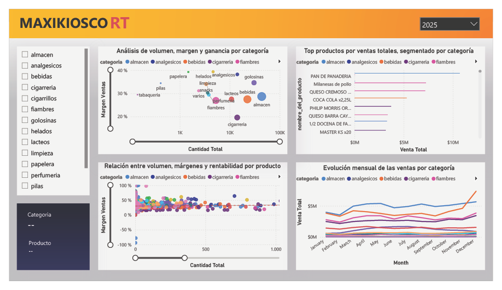
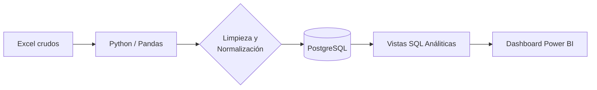

# 📊 Pipeline de Análisis de Ventas Retail
> **Proyecto End-to-End: Automatización de Ingesta, Limpieza y Visualización de Datos.**

Este proyecto resuelve el desafío de consolidar datos de ventas dispersos en múltiples archivos Excel para el negocio Maxikiosco RT, transformándolos en una base de datos relacional y un dashboard interactivo para la toma de decisiones.

---

## 🧭 Escenario de Negocio

Un negocio minorista con múltiples categorías (Almacén, Bebidas, Lácteos, etc.) genera reportes mensuales independientes en Excel.

### Problema
* Datos fragmentados en múltiples archivos
* Alto tiempo de consolidación manual
* Falta de visibilidad sobre:
    * Rentabilidad por producto
    * Evolución de ventas
    * Performance por categoría

### Solución:
Se implementa un pipeline automatizado en Python que:

* Extrae datos desde **múltiples archivos Excel**
* Limpia y estandariza la información
* Consolida los datos en una base relacional en **PostgreSQL**
* Permite análisis mediante **SQL**
* Alimenta un dashboard en **Power BI**

### 🎯 Resultados Clave
* Reducción del tiempo de consolidación: de **horas a segundos** (antes esto me tomaba horas cada mes, ahora solo segundos)
* Procesamiento automatizado de múltiples archivos mensuales
* Mejora en la calidad del dato mediante validaciones y limpieza
* Base preparada para análisis escalable (nuevos meses sin reprocesos completos)

---

## 📊 Visualización
El dashboard se encuentra en la carpeta `/dashboard`. 
- Dashboard general


- Dashboard productos



*(Nota: Para abrirlo correctamente en otra PC, asegúrate de actualizar el origen de datos en Power BI para que apunte a tu instancia local de PostgreSQL).*

---

## 🛠️ Stack Tecnológico
| Capa | Tecnología |
| :--- | :--- |
| **Lenguaje** | Python 3.13 |
| **Librerías** | Pandas, NumPy, SQLAlchemy |
| **Base de Datos** | PostgreSQL |
| **Visualización** | Power BI |
| **Entorno** | .env para gestión de credenciales |

---

## 📐 Arquitectura del Pipeline



---

## ⚙️ Componentes del Proyecto

1.  **`main.py`**: Motor de ingesta masiva. Lee los archivos de la carpeta `data/`, normaliza nombres de columnas y carga la tabla maestra en SQL.
2.  **`nuevos_meses.py`**: Gestión incremental. Permite añadir nuevos meses de datos a la base de datos existente.
3.  **`db_config.py`**: Centraliza la conexión a la base de datos usando variables de entorno (.env).
4.  **`sql/views.sql`**: Implementación de un modelo dimensional básico para optimizar el dashboard.

---

## 🚀 Cómo empezar

### 1. Requisitos
- Python 3.10+
- PostgreSQL
- `pip install -r requirements.txt` (o instale `pandas`, `sqlalchemy`, `python-dotenv`, `openpyxl`)

### 2. Configuración
Crea un archivo `.env` basado en `.env.example` con tus credenciales de base de datos local:
```env
DB_USER=tu_usuario
DB_PASS=tu_password
DB_HOST=localhost
DB_PORT=5432
DB_NAME=ventas_db
```

### 3. Ejecución
Para cargar los datos en la base de datos:
```bash
python main.py
```
---

## 💡 Impacto y Aprendizajes
- **Reducción de tiempo**: Procesos que tomaban horas de consolidación manual ahora se ejecutan en segundos.
* **Integridad del dato**: Eliminación de errores humanos mediante limpieza automatizada.
* **Escalabilidad**: El sistema está preparado para crecer con el negocio mes a mes.

---
#aclaraciones finales
* Los datos originales no se incluyen en el repositorio por motivos de tamaño y privacidad.
* Todos los datos vistos en las imagenes del dashboard no son datos reales, fueron tratados por medio de una anonimización de datos.